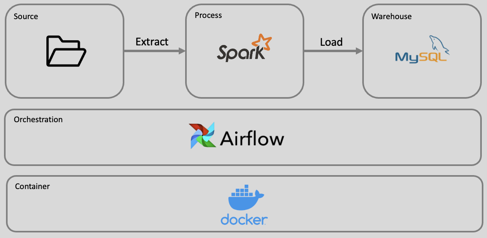

## About
Take home project for 2024 Taiwan Data Science Meetup (TWDS) mentorship program. The project demonstates how to build an ETL (Extract, Transform, Load) pipeline, orchestrated with Airflow, and delivered as Docker compose file. 

Data is provided as csv files (pseudo-regex or number parsing format), processed with Spark (PySpark), and stored to MySQL database.

**Pipeline archetecture**


## Scenario
We are implementing a small system for (row-wise) wrangling of text data. The typical use case is taking a delimited data file from a customer and massaging it to fit with a standardized schema by applying a sequence of column transforms.

## Setup
1. Clone the repo to your desktop.
2. Place the input csv file(s) in `data/input`. There are already one available. Feel free to put additional csv files or modify the existing one.
3. For data quality checking, configure input schema in `spark/config/input_schema.yaml`. The application will check the real data against the regular expression provided for each column.
* column: the column name
* format: regular expression for the expected value
4. Configure external DSL for the transformation steps in `spark/config/transform_rules.yaml`. There are several rules (rule_type) available now:

    #### Create column: each output column has to be configured exactly once
    * rename: create column from renaming a column
        * from: source column
        * to: target column
        * output_type: target column type
        * transform (optional): additional operation, e.g. proper case
        ```yaml
        # Proper case Product Name , rename it → ProductName and parse as String
        - rule_type: rename
          from: "Product Name"
          to: "ProductName"
          output_type: "String"
          transform: "proper_case"
        ```
    * concatenate: create column from concatenating columns
        * column: column
        * sourceColumns: list of columns to be concatenated
        * separator: separator when joining the sourceColumns
        * output_type: target column type
        ```yaml
        # Add a new column, concatenating Year, Month, Day → OrderDate and parse as DateTime
        - rule_type: concatenate
          column: "OrderDate"
          sourceColumns: ["Year", "Month", "Day"]
          separator: "-"
          output_type: "Date"
        ```
    * add: create column with a fixed value
        * column: column
        * value: fix value
        * output_type: target column type
        ```yaml
        # Add a new column with the fixed value "kg" → Unit and parse as String
        - rule_type: add
          column: "Unit"
          value: "kg"
          output_type: "String"
        ```

    #### Format column
    * pad_zero: pad zeros with the given length
        * column: column (String)
        * length: length
        ```yaml
        # pad zeros for Month, e.g. 6 -> 06
        - rule_type: pad_zero
          column: "Month"
          length: 2
        ```
    * format_number: format a numeric column
        * column: column
        * format: [Spark SQL - Number Pattern](https://spark.apache.org/docs/3.3.1/sql-ref-number-pattern.html)
        ```yaml
        # format String column with numeric expression
        - rule_type: format_number
          column: "Count"
          format: "9,990.09"
        ```

    #### Dataframe operations
    * keep
        * columns: list of columns to be kept
        ```yaml
        # Keep only our 6 reference columns
        - rule_type: keep
          columns: ["OrderID", "OrderDate", "ProductId", "ProductName", "Quantity", "Unit"]
        ```

Note: All Python path reference and MySQL database configuration can be done in `spark/config/config.ini`. It is not necessary to modify, but you may.

## Installation
Run the below command(s) to start a Python environment and MySQL database. The -d parameter will allow the application to run in the background (detach mode) of the same session.
```bash
docker-compose up -d
```
Run the main program.
```python
cd <location of the repo>
python3 spark/main.py
```

## Result
You may find the ETL result at `data/output` and the report for logging invalid data at `reports`. The result will also be stored in MySQL database, which can be checked with the following command(s) in your terminal:
```bash
docker exec -it mysql_container sh
mysql -h 127.0.0.1 -u root -p
```
check the result in MySQL
```bash
use order_db;
describe order_table;
select * from order_table;
```

## Data Schema
**Input (csv)**
| Column Name     | String Format |
|-----------------|---------------|
| Order Number    | d+            |
| Year            | YYYY          |
| Month           | MM            |
| Day             | dd            |
| Product Number  | [A-Z0-9]+     |
| Product Name    | [A-Z]+        |
| Count           | #,##0.0#      |
| Extra Col1      | --            |
| Extra Col2      | --            |


**Output**
| Column Name | Data Type    | Source            | Action   |
|-------------|--------------|-------------------|----------|
| OrderID     | Integer      | Order Number      | Rename   |
| OrderDate   | DateTime     | Year+Month+Day    | Add      |
| ProductId   | String       | Product Number    | Rename   |
| ProductName | String       | Product Name      | Proper Case, Rename |
| Quantity    | BigDecimal   | Count             | Rename   |
| Unit        | String       | "kg"              | Add      |

## Requirements
* The transformations should be configurable with an external DSL (like a configuration file).

    -> An external YAML file for easy configuration without writing code

* The functionality should be implemented as a library, without (significant) external dependencies.

    -> Implement each functionality as a standalone library, including data extraction, data quality checking, data transformation and data loading

* Invalid rows should be collected, with errors describing why they are invalid (logging them is fine for now).

    -> Collect invalid rows and provide error descriptions by implementing type checking and reporting

* The data tables can have a very large number of rows.

    -> Consider implementing additional data simulation functions to efficiently handle large data tables

## Assumptions
* Each output column should be configured exactly once with the 'Create column' rule in `config/transform_rules.yaml`. You can find more details about the 'Create column' rule in the [previous section](#create-column).
* Regular expressions are updated according to the sample data
    * Product Number: allow dashes (-)
    * Product Name: allow spaces

## Todo
* Leverage cloud platform such as S3 for placing input data, and automize with Airflow
* Simulate large amount of data and seek for high efficiency
* Deploy spark application with Docker, including master and worker nodes

## Reference
1. Wang, Y., & Zhang, Y. (2017). A Design of ETL Pipeline for Data Warehouse. In *2017 7th International Workshop on Computer Science and Engineering* (pp. 41-45). IEEE. [Link](http://www.wcse.org/WCSE_2017/041.pdf)
https://blog.csdn.net/weixin_52785140/article/details/130774975